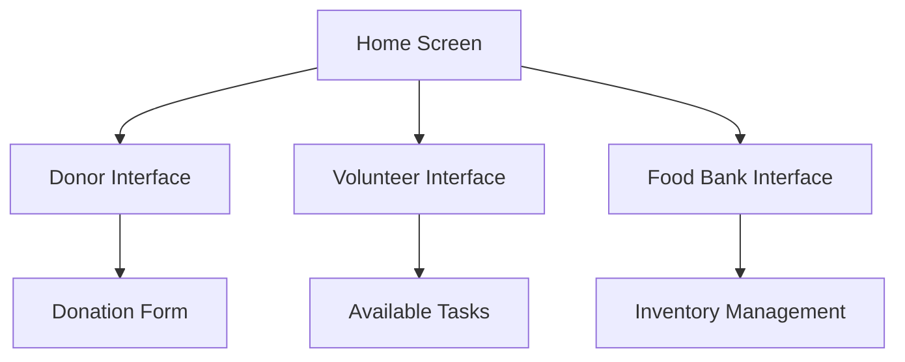

## Introduction

Last weekend, I participated in my first-ever university hackathon. It was an exhilarating 48-hour journey filled with coding, learning, and lots of coffee. In this blog post, I'll share my experience, the challenges we faced, and the lessons I learned along the way.

## The Challenge

Our team of four was tasked with creating a mobile app that could help solve a local community problem. We chose to build a React Native app that connects local food banks with donors and volunteers. The app, which we named "FoodLink", aimed to streamline the process of food donation and volunteer coordination.

<!-- toc -->

## Day 1: Planning and Setup

### Brainstorming and Wireframing

We kicked off the hackathon with a brainstorming session. Using a digital whiteboard, we sketched out our ideas and created rough wireframes for the app. Here's a simplified version of our initial app structure:

### Development Setup

After finalizing our wireframes, we set up our development environment. We decided to use Expo for React Native, which allowed us to quickly test our app on both iOS and Android devices without much hassle. The setup process was smooth, and by the end of the day, we had a basic skeleton of our app ready.

### Challenges Faced

As with any project, we faced our share of challenges. One significant hurdle was integrating real-time updates for the volunteer tasks and food donations. Initially, we attempted to use Firebase, but we quickly realized that we needed a more tailored solution to manage our data effectively. We pivoted to using a custom backend built with Node.js and Express, which allowed us more flexibility in managing user interactions.

## Day 2: Implementation and Iteration

### Frontend Development

With our backend in place, we focused on developing the frontend. We divided tasks among our team members—one worked on the donor interface, another on the volunteer interface, and I took charge of the food bank interface. It was fascinating to see how each part of the app started coming together. We utilized libraries like React Navigation for smooth transitions between screens and Axios for API calls.

### Testing and Feedback

By the afternoon, we had a working prototype of "FoodLink." We decided to gather feedback from other participants. Their insights were invaluable. They pointed out issues with the user flow and suggested enhancements that we hadn’t considered. We made quick iterations based on this feedback, polishing the app just in time for the final presentation.

## The Final Presentation

After a whirlwind of coding, testing, and refining, it was time to present our app. We showcased the key features of "FoodLink," highlighting how it could facilitate food donations and volunteer coordination. The judges seemed impressed with our approach and the technical challenges we overcame.

## Conclusion

Participating in my first hackathon was an incredibly rewarding experience. I not only learned technical skills but also valuable lessons about teamwork, adaptability, and the importance of user feedback. If you ever get the chance to participate in a hackathon, I highly recommend it! The thrill of building something from scratch in such a short time frame is unmatched.

## Key Takeaways

1. **Teamwork is Essential**: Collaboration and communication are crucial in a fast-paced environment.
2. **Embrace Feedback**: Don’t hesitate to seek external opinions on your work; it can lead to significant improvements.
3. **Adaptability Matters**: Be prepared to pivot your approach when you encounter challenges.
4. **Have Fun**: Enjoy the process, celebrate small wins, and learn from every experience.

Thank you for reading about my hackathon adventure! I’m excited to apply what I learned to my future projects and challenges.